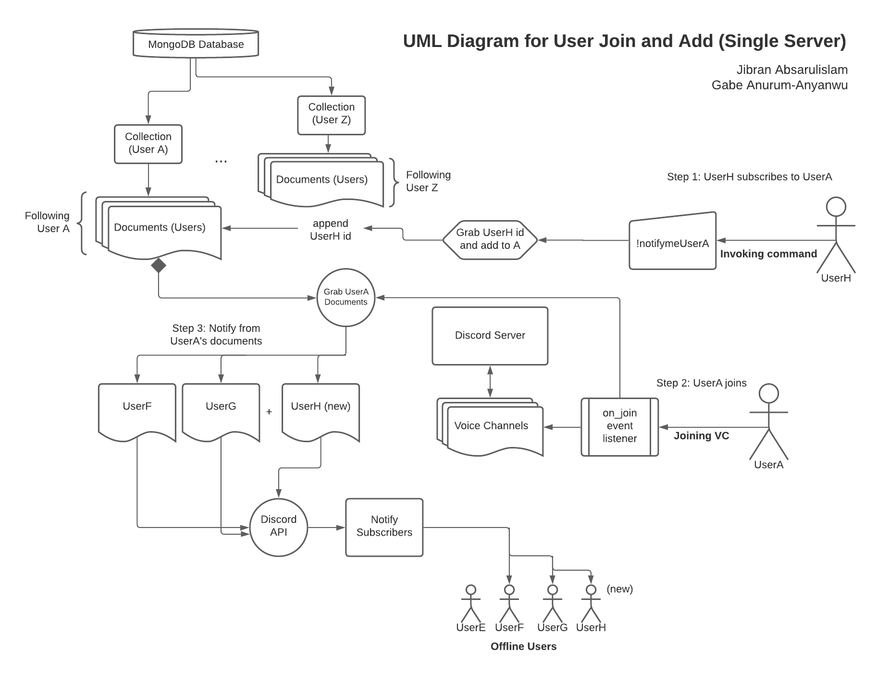

# ChatJoin
## A server utility that lets users know if someone joins

### Technologies
- [Python 3.8+](https://www.python.org/)
- [discord.py](https://discordpy.readthedocs.io/en/latest/index.html)
- [MongoDB](https://www.mongodb.com/)

### Concepts
- Object-oriented design
- Server hosting
- Asynchronous function calls
- Database operations
- Object validation
